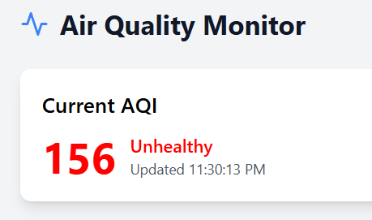
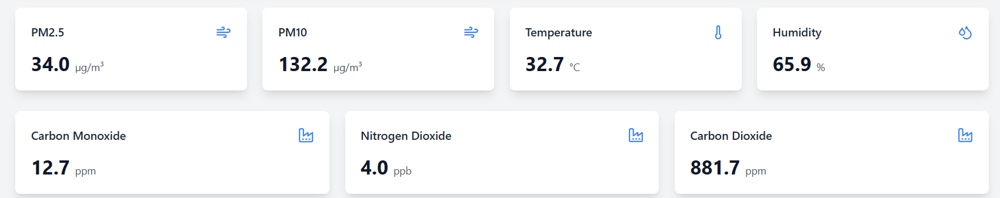

# 🌫️ Air Quality Detector Using Edge Computing

[](LICENSE)
[](#)
[](#)
[](#)

> A real-time, low-latency air quality monitoring system leveraging edge computing to analyze and visualize pollution data locally using IoT sensors and microcontrollers.

---

## 📸 Screenshot




---

---

## 🌐 Visit Website

👉 [Click here to view the live Air Quality Dashboard](https://jazzy-pithivier-dc198f.netlify.app/)

> ⚠️ *This is a sample link. Replace it with your actual deployed site if hosted on GitHub Pages, Netlify, Vercel, etc.*

---


## 📌 Overview

Air pollution is a major public health issue. Traditional monitoring systems suffer from high latency and lack granularity due to centralized data processing.

This project provides a smart, decentralized alternative using **edge computing**, enabling:
- ⚡ Real-time AQI calculation
- 🛰️ Local sensor data processing
- 📉 Reduced cloud dependency
- 📈 Dashboard visualizations and alerts

---

## 🧰 Tech Stack

- **Hardware**: Raspberry Pi, Grove Sensors (PM2.5, NO₂, CO, SO₂, etc.)
- **Programming**: Python, Bash
- **Connectivity**: Wi-Fi / LoRa / GSM
- **Visualization**: Flask, Chart.js, HTML/CSS
- **Optional Cloud**: Firebase / ThingSpeak

---

## 🏗️ Architecture
[Sensors] → [Edge Device (Raspberry Pi)] → [AQI Engine + Alert System] → [Dashboard or Cloud Storage]


---

## 🛠️ Features

- 📡 IoT-enabled sensing of CO, PM2.5, NO₂, SO₂, Temp, Humidity
- ⚙️ Edge-computed AQI with local thresholds
- 📊 Real-time graphs, daily trends, and area comparisons
- 🔔 Alert system for pollution spikes
- 🔋 Energy-efficient and scalable design

---

## 🚀 Getting Started

1. Clone the repo  
```bash
git clone https://github.com/yourusername/air-quality-detector-edge-iot.git
```
2. Install Dependencies
```bash
pip install -r requirements.txt
```
3. Run the system
```bash
python main.py
```
4. Access the dashboard at
```bash
http://localhost:5000
```
## 🧪 Results

- ✅ Deployed in urban areas with accurate AQI readings.
- 📊 Correlated closely with official monitoring stations.
- 📈 Visual insights included:
  - Day-wise AQI trends
  - Real-time pollutant levels
  - Temperature vs AQI overlays


---

## 👨‍💻 Team

| Name          | Roll Number  |
|---------------|--------------|
| Suman Kumar   | 22BCS15488   |
| Chakshu Jain  | 22BCS15224   |
| Prashant      | 22BCS16505   |

---
## 🏫 Institution

**Chandigarh University**  
*Bachelor of Engineering – Computer Science (2025)*

---

## 📜 License

This project is licensed under the **MIT License**.  
For more details, see the [LICENSE](LICENSE) file.

